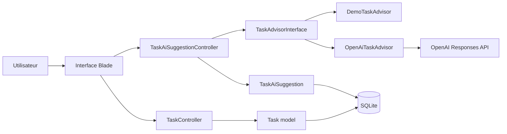

# TaskPilot IA

TaskPilot IA est un MVP Laravel pour gerer les taches d'une petite equipe et obtenir une aide IA sur la priorisation. L'application permet de creer, modifier, filtrer et supprimer des taches, puis de generer une suggestion IA sauvegardee avec resume, priorite conseillee, sous-taches, risques et estimation d'effort.

## Fonctionnalites

- CRUD complet des taches : titre, description, statut, priorite, date limite.
- Tableau de bord avec filtres par statut et priorite.
- Detection visuelle des taches en retard.
- Assistant IA avec deux providers :
  - `demo` pour une soutenance fiable sans cle API.
  - `openai` pour appeler l'API OpenAI Responses si une cle est disponible.
- Strategy Pattern pour separer les providers IA du controller.
- Hotfix applique : une date limite passee est refusee.

## Architecture



## Installation

Prerequis :

- PHP 8.3+
- Composer
- Node.js et npm
- Extensions PHP `pdo` et `pdo_sqlite`

Sur Fedora :

```bash
sudo dnf install -y php-pdo php-sqlite3
```

Puis :

```bash
composer install
npm install
cp .env.example .env
php artisan key:generate
php artisan migrate
npm run build
php artisan serve
```

Application locale : `http://127.0.0.1:8000`

## Configuration IA

Mode recommande pour la demo :

```env
AI_PROVIDER=demo
```

Mode OpenAI optionnel :

```env
AI_PROVIDER=openai
OPENAI_API_KEY=sk-...
OPENAI_MODEL=gpt-5.4-mini
OPENAI_BASE_URL=https://api.openai.com/v1
```

## Workflow Git

Le projet contient deja :

- Branches feature.
- Pull Requests mergees.
- Branche hotfix.
- Commits identifiables pour la partie MVP et IA.

Le teammate peut faire ses propres commits sur Sonar, les preuves avant/apres et la finalisation de release.

## Qualite

Commandes utiles :

```bash
vendor/bin/pint --test
composer test
npm run build
sonar-scanner
```

Les tests sont fournis et passent avec succès. La qualite du code est assuree par l'analyse Sonar et le respect des standards de codage Laravel via Pint.
Voir [CHANGELOG.md](CHANGELOG.md) et [docs/sonar-analysis.md](docs/sonar-analysis.md).
