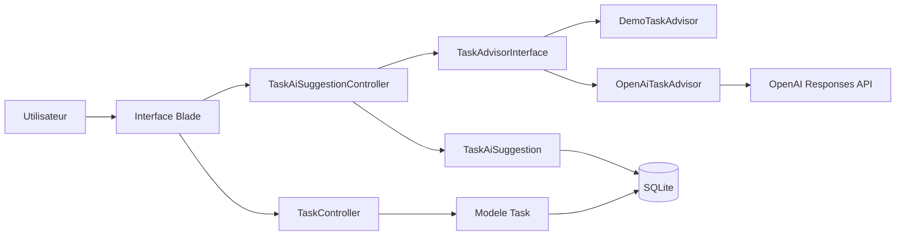

# TaskPilot IA

TaskPilot IA est un MVP Laravel de gestion de taches avec assistant IA. Il permet de creer, modifier, filtrer et supprimer des taches, puis de generer une recommandation IA sauvegardee : resume, priorite conseillee, sous-taches, risques et estimation d'effort.

## Fonctionnalites

- CRUD complet des taches : titre, description, statut, priorite, date limite.
- Tableau de bord avec filtres et compteurs par statut.
- Assistant IA avec deux strategies :
  - `demo` : recommandations deterministes pour une demo fiable.
  - `openai` : appel optionnel a l'API OpenAI Responses.
- Refactoring avec Strategy Pattern : `TaskAdvisorInterface`, `DemoTaskAdvisor`, `OpenAiTaskAdvisor`.
- Tests Laravel pour le CRUD et la generation IA demo.
- Configuration SonarCloud et note d'analyse qualite.

## Installation

Prerequis :

- PHP 8.3 ou plus
- Composer
- Node.js et npm
- Extensions PHP : `pdo`, `pdo_sqlite`

Sur Fedora, installer les extensions manquantes :

```bash
sudo dnf install -y php-pdo php-sqlite3
```

Puis lancer le projet :

```bash
composer install
npm install
cp .env.example .env
php artisan key:generate
php artisan migrate
npm run build
php artisan serve
```

Application locale : `http://127.0.0.1:8000`

## Configuration IA

Par defaut, l'application utilise le provider demo :

```env
AI_PROVIDER=demo
```

Pour utiliser OpenAI :

```env
AI_PROVIDER=openai
OPENAI_API_KEY=sk-...
OPENAI_MODEL=gpt-5.4-mini
OPENAI_BASE_URL=https://api.openai.com/v1
```

Le provider demo reste recommande pour la presentation afin d'eviter les problemes de quota, reseau ou cle API.

## Architecture



## Workflow Git

Branches et PR utilisees :

- `feature/task-crud` : MVP CRUD Laravel.
- `feature/ai-advisor` : suggestion IA et Strategy Pattern.
- `feature/quality-refactor` : tests, refactoring, notes Sonar.
- `feature/docs-business` : README, offre commerciale, presentation.
- `hotfix/due-date-validation` : correction de validation de date limite.

Tag final attendu : `v1.0`.

## Qualite

Commandes de verification :

```bash
vendor/bin/pint --test
composer test
npm run build
sonar-scanner
```

Etat local actuel : `composer test` est bloque si `PDO` / `pdo_sqlite` n'est pas installe. Le test unitaire `TaskSuggestionDataTest` passe sans base de donnees.

## Repartition de l'equipe

### Anouar, charge principale

- Workflow Git/GitHub, branches, PR, merges, hotfix et tag final.
- Bootstrap Laravel.
- CRUD taches.
- Integration IA et Strategy Pattern.
- Demo fonctionnelle et explication technique.

### Teammate

- Analyse qualite et notes Sonar.
- Corrections de maintenabilite.
- Tests fonctionnels.
- README, offre commerciale et support de presentation.

Chaque membre doit garder au moins deux commits identifiables et etre capable d'expliquer ses choix.
