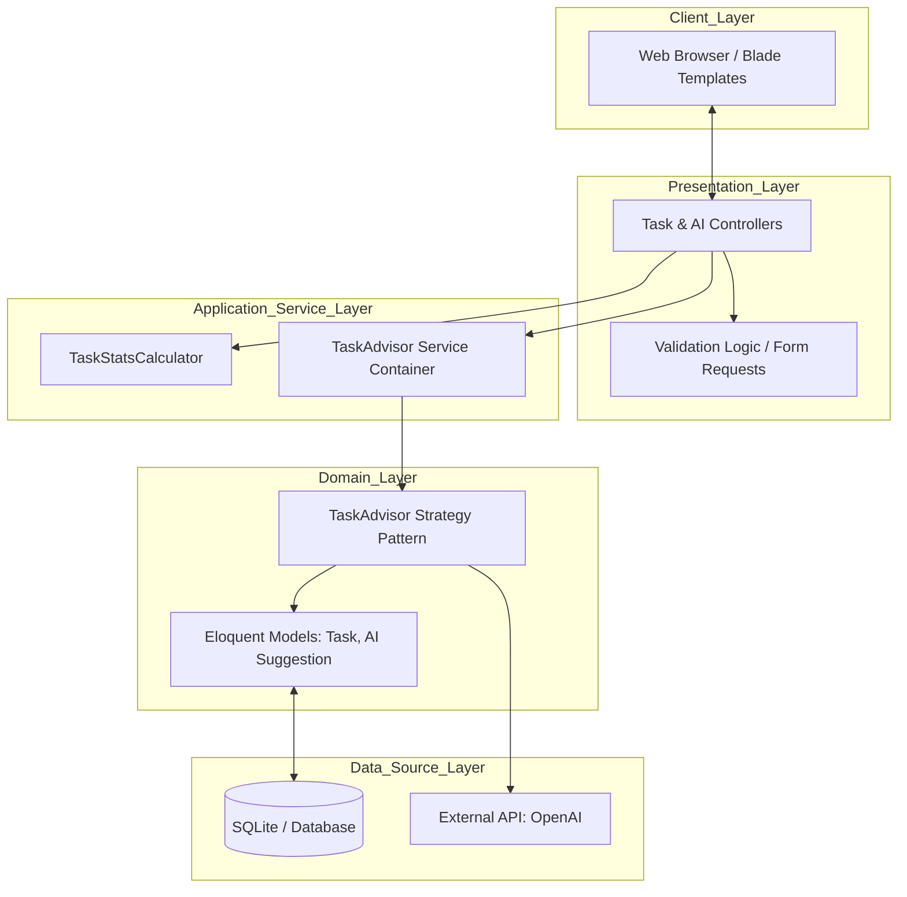

# System Architecture: TaskPilot IA

TaskPilot IA is engineered as a robust, scalable, and maintainable task management platform. This document details the architectural decisions, design patterns, and data flow that define the system.

---

## 1. High-Level Architecture

The system follows a classic **N-Tier Architecture** implemented within the Laravel framework, emphasizing separation of concerns and modularity.

---

## 2. The Strategy Design Pattern

To achieve high decoupling between the application logic and external AI providers, we implement the **Strategy Pattern**. This allows the system to remain agnostic of the underlying AI engine.

### Implementation Details
The architecture relies on the following components:

*   **Contract (`TaskAdvisorInterface`)**: Defines the mandatory `suggest()` method.
*   **Concrete Strategies**:
    *   `OpenAiTaskAdvisor`: Handles real-time API communication, prompt engineering, and response extraction.
    *   `DemoTaskAdvisor`: Provides deterministic, high-speed responses for development and CI/CD environments.
*   **Dynamic Binding**: The `AppServiceProvider` performs a contextual binding at runtime based on the `AI_PROVIDER` environment variable.

### Dependency Inversion
The `TaskAiSuggestionController` never instantiates an advisor directly. Instead, it type-hints the `TaskAdvisorInterface`, allowing the Service Container to inject the appropriate implementation. This makes the system easily testable via mock injection.

---

## 3. Data Flow and Persistence

### AI Suggestion Lifecycle
1.  **Request**: User triggers a "Get Suggestion" action for a specific `Task`.
2.  **Resolution**: The Controller requests an implementation of `TaskAdvisorInterface`.
3.  **Execution**: The resolved strategy (e.g., OpenAI) processes the task data.
4.  **Parsing**: The `OpenAiResponseTextExtractor` sanitizes and structures the raw API response.
5.  **Caching**: The resulting `TaskSuggestionData` is persisted in the `task_ai_suggestions` table, linked to the `Task`.
6.  **Response**: The UI displays the suggestion from the database, ensuring subsequent views do not trigger expensive API calls.

---

## 4. Service Layer and Refactoring

We adhere to the **Single Responsibility Principle (SRP)** by offloading complex logic from Controllers into dedicated Services:

*   **`TaskStatsCalculator`**: Aggregates complex metrics (Completion rates, Priority distribution) for the dashboard.
*   **`OpenAiResponseTextExtractor`**: Encapsulates the logic for parsing semi-structured AI responses, protecting the advisor from changes in API response formats.

---

## 5. Quality and Reliability Standards

*   **Validation Layer**: Form Requests handle all input sanitization, including a critical hotfix for preventing retrospective deadline assignments.
*   **Observability**: Integrated logging captures API latencies and communication failures, facilitating rapid debugging in production.
*   **Static Analysis**: The project is continuously audited by **SonarCloud**, maintaining a strict baseline for code complexity and maintainability.

---

*Document Version: 1.1*
*Last Updated: June 2026*
