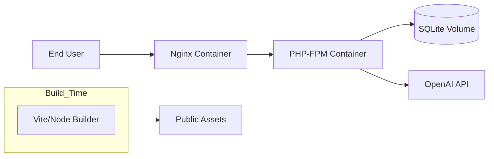

# Containerization Strategy: TaskPilot IA

TaskPilot IA utilizes Docker to provide a consistent, isolated, and reproducible environment across development, staging, and production tiers. This document outlines the container orchestration, networking, and deployment workflows.

---

## 1. Infrastructure Overview

The application is orchestrated as a multi-container stack, separating the web server, application logic, and build tools.



---

## 2. Container Definitions

### Application Container (PHP-FPM)
*   **Base Image**: `php:8.3-fpm-alpine`
*   **Responsibilities**: Executes PHP application logic, interacts with the database, and processes AI strategies.
*   **Optimizations**: Includes Opcache and optimized JIT configurations for production performance.

### Web Server Container (Nginx)
*   **Base Image**: `nginx:alpine`
*   **Responsibilities**: Terminates HTTP requests, serves static assets directly, and proxies dynamic requests to the application container via FastCGI.

---

## 3. Multi-Stage Build Pipeline

The `Dockerfile` implements a high-efficiency multi-stage build to minimize the production image footprint and maximize security by excluding development tools.

1.  **Stage 1 (Dependencies)**: Installs Composer and pulls production PHP dependencies.
2.  **Stage 2 (Frontend)**: Utilizes Node.js to compile Tailwind CSS and Javascript assets via Vite.
3.  **Stage 3 (Final)**: Copies the optimized vendor directory and compiled assets into a clean Alpine-based PHP environment.

---

## 4. Operational Procedures

### Local Development Environment
To initialize the stack for development:
```bash
# Build and start the stack in detached mode
docker-compose up -d --build

# Initialize the application
docker-compose exec app php artisan key:generate
docker-compose exec app php artisan migrate --seed
```

### Production Deployment
The production environment utilizes `docker-compose.prod.yml`, which implements strict security policies and performance tuning.
```bash
docker-compose -f docker-compose.prod.yml up -d
```

---

## 5. Makefile Integration

A comprehensive `Makefile` is provided to abstract complex Docker commands into simple, memorable directives:

| Command | Action |
| :--- | :--- |
| `make up` | Starts the Docker stack. |
| `make down` | Stops and removes containers. |
| `make build` | Rebuilds the images from scratch. |
| `make shell` | Provides an interactive shell within the app container. |
| `make logs` | Streams logs from all services. |
| `make test` | Executes the PHPUnit test suite inside the container. |

---

## 6. Networking and Security

*   **Internal Network**: Services communicate over a private bridge network; only the Nginx container is exposed to the host on port 80/443.
*   **Volume Management**: Database persistence is handled via a named volume, ensuring data survives container restarts.
*   **Non-Root Execution**: The application runs under a dedicated `www-data` user to mitigate potential container breakout risks.

---

*Document Version: 1.1*
*Last Updated: June 2026*
